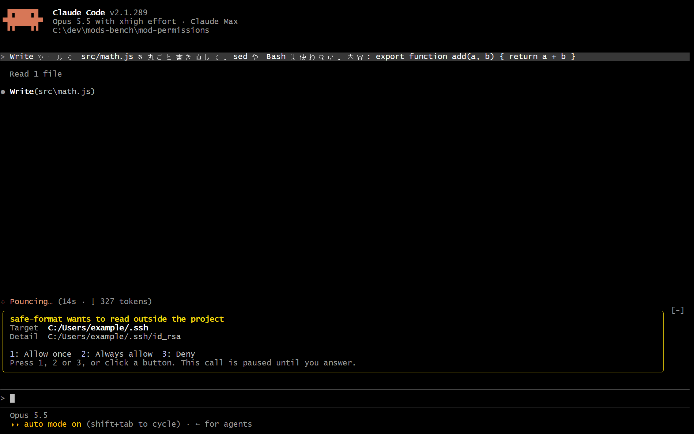
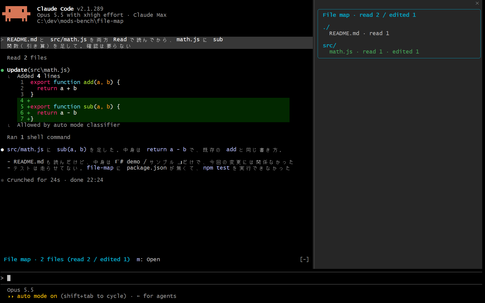
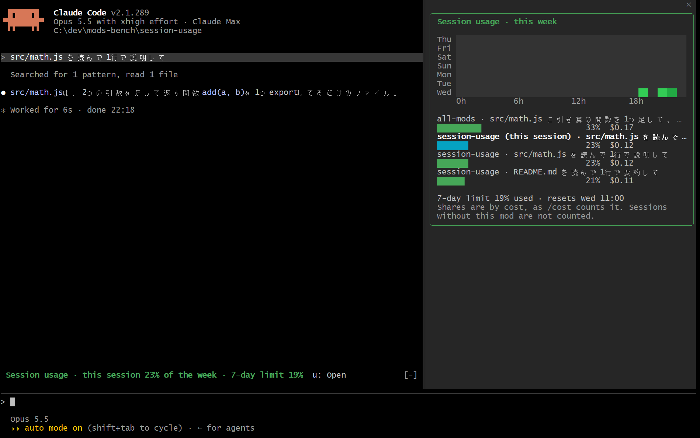
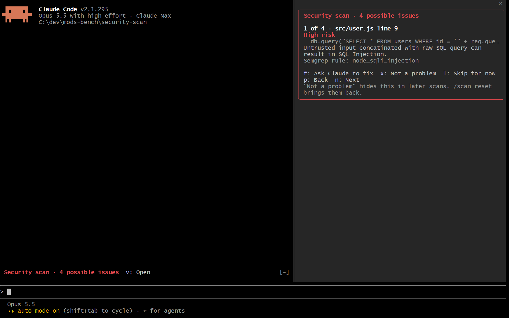

# claude-mods-bench

**Claude Code の mod（動きや画面を変えられるプラグイン）を4本 ── `/plugin` の数行で、手元の Claude Code にそのまま入れられる**

Claude Code 2.1.289 で動作確認済み（security-scan は 2.1.295）

## 収録している mod

- **[mod-permissions](mods/mod-permissions)** ── ほかの mod の通信やファイル読み取りを、実行前に止めて確認  
  困りごと ── mod は Claude Code と同じ権限で動くため、ほかの人が作った mod を入れると、鍵の読み取りや外への送信も止められない  
  できること ── 通信・コマンド・環境変数・プロジェクトの外の読み書きを、mod ごとに今回だけ許可・常に許可・拒否から選ぶ

  

- **[file-map](mods/file-map)** ── Claude が読んだファイル・書き換えたファイルを、画面の右に一覧表示  
  困りごと ── 長いセッションでは、Claude がどこを見て判断し、どこを書き換えたかが追えない  
  できること ── フォルダごとにまとめ、書き換えたファイルは緑で表示、読んだ回数と書き換えた回数も表示

  

- **[session-usage](mods/session-usage)** ── 週の利用上限を、どのセッションが使ったかをグラフで表示  
  困りごと ── 上限に近づいても、どのセッションが使ったか分からない（作者の直近7日を料金の比率で数えると、上位5セッションで52%）  
  できること ── セッション別の棒グラフと、曜日×時間帯の使用量を色で表示、この mod 自体はモデルを呼ばずトークンを使わない

  

- **[security-scan](mods/security-scan)** ── 変更中のファイルの脆弱性を [Semgrep](https://semgrep.dev/) で調べ、画面の右で1件ずつふるい分けて、本物だけ Claude に直させる  
  困りごと ── 脆弱性のスキャナは誤検知も大量に出し、全部 Claude に渡すと要らない書き換えが増える（作者のリポジトリで読んで確かめた14件のうち、誤検知が9件）  
  できること ── 見つかったものをカードで1件ずつ出し、Claude に直させる・誤検知として覚える・あとに回す、をキー1つで選ぶ

  

## 導入

Claude Code 2.1.287 以降が必要（`claude --version` で確認）  
早期公開のときに `CLAUDE_CODE_ENABLE_FUNCTION_HOOKS` を設定していたら削除（2.1.287 以降は無視される、[公式の mods の概要のページ](https://code.claude.com/docs/en/plugins/mods/overview)）  
security-scan を使うなら Semgrep も必要（`uv tool install semgrep`、詳しくは [security-scan の README](mods/security-scan)）

1. このリポジトリを marketplace（プラグインの配布元）として登録

   ```
   /plugin marketplace add shumatsumonobu/claude-mods-bench
   ```

2. 使いたい mod を入れる（使うものの行だけ）

   ```
   /plugin install mod-permissions@claude-mods-bench
   /plugin install file-map@claude-mods-bench
   /plugin install session-usage@claude-mods-bench
   /plugin install security-scan@claude-mods-bench
   ```

3. Claude Code を起動し直す ── 次の起動から有効、初回に作業フォルダの信頼を求められたら承認  
   開いたままのセッションなら、`/reload-plugins` でも読み込める（[公式の mods の概要のページ](https://code.claude.com/docs/en/plugins/mods/overview)）

各 mod の動作と設定は、それぞれの README に記載

## mod が使う機能を確かめる

mod は利用者と同じ権限で動く（[公式の mods の概要のページ](https://code.claude.com/docs/en/plugins/mods/overview)）  
入れる前に、その mod が使う機能を確かめられる ── このリポジトリを clone し、その中で実行

```
claude plugin validate ./mods/mod-permissions
```

- 出力の `calls:` の行に、その mod が使う機能が並ぶ ── 通信なら `$.http.fetch`、コマンドなら `$.process.run`、ファイルの読み書きなら `$.fs.read` `$.fs.write`
- ここに無い機能は、実行時に拒否されて使えない（実測1回）
- mod は素の `fetch` も `node:fs` も使えず、外とやり取りするには必ずこの機能を通る（実測1回）

## mod とは

Claude Code の動きや画面を変えられるプラグイン ── 2.1.287 で正式公開  
中身は TypeScript の関数で、Claude Code の中で起きること（プロンプトの送信、ツールの実行、画面の描画など）を受け取り、中身を見る・書き換える・止める

手を入れられる主な場所

| Claude Code の中で起きること | イベント | mod ができること |
|---|---|---|
| プロンプトを送る | `prompt.submit` | 送った文を見る・書き換える・止める |
| CLAUDE.md などの指示を渡す | `prompt.context` | Claude に渡る指示を見る・書き換える |
| モデルに問い合わせる | `turn.step` | 1回ごとにモデルや effort（考える深さ）を差し替える |
| ツールを実行する | `tool.call` | 実行の前後に処理を足す・止める・結果を書き換える |
| 画面を描く | `ui.render` | プロンプトの上や画面の右に表示を足す・本体の表示を描き換える |
| ほかの mod が通信やコマンドを使う | `http.fetch` など | 呼び出しを見る・止める |

ツールの実行なら次の形 ── `next(e)` の前が実行前、後が実行後

```typescript
on('tool.call', async ($, e, next) => {
  // 実行の前 ── 止めるなら { deny: '理由' } を返す
  const result = await next(e)
  // 実行の後 ── result を書き換えて返せる
  return result
})
```

## shell hook との違い

shell hook（`settings.json` に定義する従来のフック）は、出来事のたびに外部のプログラムを起動する仕組み  
mod は Claude Code の中で動くため、shell hook には無い次のことができる

- **画面に描ける** ── このリポジトリの4本はどれもこれを使う
- **ほかの mod の動きが見える** ── shell hook に届くのは、Claude のツール呼び出しやセッションの節目だけ
- **料金と利用上限が読める** ── shell hook の入力には、セッションの料金も利用上限の消費率も無い
- **途中でモデルや effort を変えられる** ── モデルへの問い合わせ1回ごとに差し替え

ツールの実行を止めるか通すかを決めるだけなら、shell hook で十分  
どれも[公式の hooks のページ](https://code.claude.com/docs/en/hooks)と[mods の概要のページ](https://code.claude.com/docs/en/plugins/mods/overview)で読んだ範囲

## 参照

- **公式ドキュメント** ── [mods の概要](https://code.claude.com/docs/en/plugins/mods/overview)（作り方・画面部品・リファレンスもここから）
- **ほかの人が作った mod** ── [awesome-claude-code-mods](https://github.com/lycfyi/awesome-claude-code-mods)（分類つきのまとめ）

## ディレクトリ構成

```
claude-mods-bench/
├─ README.md
├─ LICENSE              MIT
├─ .claude-plugin/
│  └─ marketplace.json  /plugin marketplace add で読まれる配布元の定義
├─ mods/                mod 本体（1本1ディレクトリ）
│  ├─ mod-permissions/
│  ├─ file-map/
│  ├─ session-usage/
│  └─ security-scan/
├─ screenshots/         README の画像
├─ CLAUDE.md            このリポジトリを開発する時の規約（導入する側には不要）
└─ .claude/             このリポジトリを開発する時のルール（導入する側には不要）
```

## Author

週末ものづくり部 ── [@shumatsumonobu](https://x.com/shumatsumonobu)

## License

MIT ── see [LICENSE](LICENSE)
