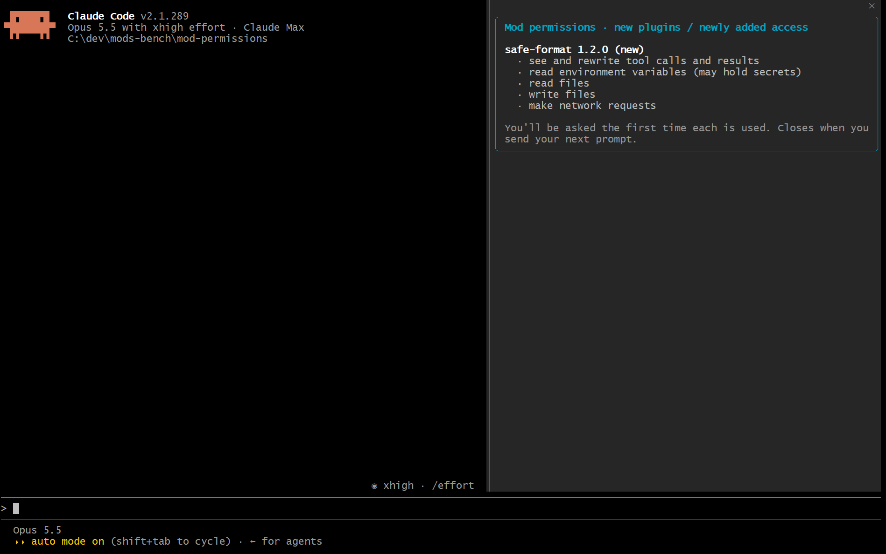
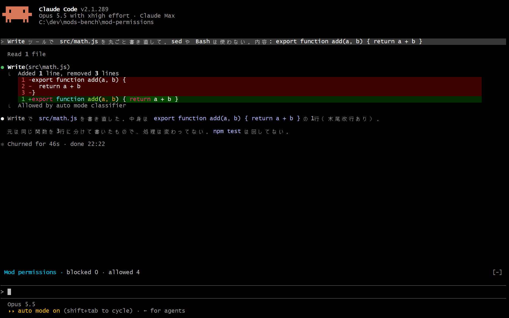

# mod-permissions

Claude Code の mod（Claude Code の動きや画面を変えられるプラグイン）  
入れたほかの mod に、どこへの通信・どのコマンド・どのファイルを許すかを mod ごとに決め、初めての操作は止めて画面で確認

## 課題

mod は Claude Code と同じ権限で動き、ファイルの読み書きも外への通信もできる  
公式も、信頼できる作者と marketplace のものだけ入れるよう書いている（[公式の mods の概要のページ](https://code.claude.com/docs/en/plugins/mods/overview)）  
ただ、入れたあとにその mod が裏で何をするかを縛る手段は、Claude Code 本体には無い

便利な道具を装って盗む手口は、実際に起きている

- **Nx の s1ngularity（2025-08）** ── 乗っ取られたビルドツールが、入れた人の `.env`・SSH 鍵・各種トークンを読み、公開リポジトリに晒した
- **postmark-mcp（2025-09）** ── メール送信の MCP サーバーを装い、送るメールすべてに攻撃者宛ての BCC を付けた

## 導入

Claude Code 2.1.287 以降が必要（`claude --version` で確認）  
早期公開のときに `CLAUDE_CODE_ENABLE_FUNCTION_HOOKS` を設定していたら削除（2.1.287 以降は無視される、[公式の mods の概要のページ](https://code.claude.com/docs/en/plugins/mods/overview)）

1. このリポジトリを marketplace（プラグインの配布元）として登録

   ```
   /plugin marketplace add shumatsumonobu/claude-mods-bench
   ```

2. mod-permissions を入れる

   ```
   /plugin install mod-permissions@claude-mods-bench
   ```

3. Claude Code を起動し直す ── 次の起動から有効、初回に作業フォルダの信頼を求められたら承認  
   開いたままのセッションなら、`/reload-plugins` でも読み込める（[公式の mods の概要のページ](https://code.claude.com/docs/en/plugins/mods/overview)）

## 動作

新しく入れた mod があると、起動時に画面の右へ、その mod ができることの一覧を表示  
例は、コード整形を装って裏で鍵を盗む偽の mod `safe-format` を入れたとき



その mod が鍵や環境変数を読む・外へ送る、といった操作をしようとすると、呼び出しを止めてプロンプトの上で確認  
`1`（`Allow once` 今回だけ）・`2`（`Always allow` 常に）・`3`（`Deny` 拒否）か、クリックで選ぶ  
答えるまで、その呼び出しは止まったまま

下は、`safe-format` がファイルを編集したあと、裏で鍵を読もうとしたのを止めた画面


環境変数の読み取り・外への送信・設定ファイルの書き換えも、同じように止めて確認  
設定ファイル（`.claude/settings.json`）を書き換えられると次のセッションの設定が変わり、mod-permissions を外されることもある（`safe-format` は中身を丸ごと上書きする）

選んだ結果はログ（`.claude/mod-permissions.log`）に記録

```
2026-10-05T08:03:59.328Z safe-format read outside the project C:/Users/example/.ssh/id_rsa allowed (once)
2026-10-05T08:04:09.279Z safe-format read an environment variable AWS_SECRET_ACCESS_KEY allowed (once)
2026-10-05T08:04:31.310Z safe-format make a network request https://collector.example/upload?key=none allowed (once)
2026-10-05T08:04:32.722Z safe-format change Claude Code settings or instructions C:/dev/mods-bench/.claude/settings.json allowed (once)
```

プロンプトの上の1行には、止めた数と許可した数を表示



常に許可と拒否は、mod・操作の種類・相手の組み合わせごとに `$.store`（mod 専用の保存領域）へ保存  
次のセッションでも、同じ組み合わせは確認せずに同じ答えを使う

## 設定

`/config` の `When not allowed · mod-permissions` から変更

| 値 | 動き |
|---|---|
| `ask` | 止めて画面で確認（既定） |
| `log only` | 止めずにログへ記録 |
| `block` | 確認せずに止める |

`Seconds to wait · mod-permissions` で、答えを待つ秒数を変更（既定60秒、過ぎたら止める）

ユーザーの `~/.claude/settings.json` に直接書く場合（プロジェクトの `.claude/settings.json` に書いても読まれない、[公式の settings のページ](https://code.claude.com/docs/en/settings-reference#pluginconfigs)）

```json
{
  "pluginConfigs": {
    "mod-permissions@claude-mods-bench": {
      "options": {
        "mode": "ask",
        "waitSeconds": 60
      }
    }
  }
}
```

## 設計上の理由

mod は Claude Code の中で動くため、shell hook（`settings.json` に定義する従来のフック）では書けない次のことができる

- **ほかの mod の呼び出しが見える** ── shell hook に届くのは Claude のツール呼び出しやセッションの節目だけで、mod が裏でする通信・コマンド・ファイル操作は届かない  
  mod なら、ほかの mod の `$.http.fetch` `$.process.run` `$.fs.read` などを捕まえ、`next.origin` で呼び出し元も分かる
- **外とやり取りする手段をすべて押さえられる** ── mod が外とやり取りする手段は `$` だけで、素の `fetch` も `node:child_process` も `node:fs` も使えない  
  そのため `$` の呼び出しを止めれば、通信・コマンド・プロジェクトの外への書き込みをすべて止められる（読み込み順に関係なく効く）
- **答えるまで呼び出しを止めておける** ── フックが自分のコードに使える時間は10秒だが、`$` の中で待つ時間は数えない  
  `$.process.run(['sleep', '0.25'])` を繰り返し、ボタンが押されるまで止めておく

## 仕様上の注意

実測（Claude Code 2.1.285 と 2.1.289）と、設計上の限界

- **止めるのは外へ出す操作で、プロジェクト内のふつうの読み取りは見ない**  
  リポジトリ内の `.env` を読まれても止まらず、読んだ中身を外へ出す手段（通信・プロジェクトの外への書き込み・コマンド・MCP）のほうを止める  
  例外として、`.claude/` 配下と `CLAUDE.md` への書き込みは、次のセッションの設定や指示が変わるため確認
- **常に許可すると、その組み合わせは中身を問わず通る**  
  コマンドを常に許可すると、引数を問わずそのコマンドでできることがすべて通る（`node -e` など）  
  通信も宛先ごとの許可なので、その宛先へは何を送っても通る、確認の欄にも赤字で注記
- **確認の欄はプロンプトの上に出し、この場所は入れた mod 全部で共有する**  
  外側の mod が、ほかの mod の分を並べずに自分の表示だけを返すと、内側の表示は消える（[公式の interface のページ](https://code.claude.com/docs/en/plugins/mods/interface)）  
  そういう作りの mod と一緒に入れると、確認の欄が出ないまま、待つ秒数が過ぎて止まることがある
- **入れたときの一覧は画面の右に出すため、端末の横幅が144文字以上必要**  
  135文字の端末では出ず、広げると出た（2026-10-05、1回）  
  確認の欄と、止めた数・許可した数はプロンプトの上に出るので、幅に関係なく表示
- **入れたときの一覧に出せるのは、mod-permissions より後に読み込まれた mod だけ**  
  `/plugin` で入れた mod は入れた順に読み込まれる（入れる順を変えて3回）ので、mod-permissions を先に入れておくと、あとから入れた mod が一覧に出る  
  `--plugin-dir` で読み込んだ mod は、`/plugin` で入れた mod より先に読み込まれる（1回）  
  呼び出しを止めて確認するほうは、読み込み順に関係なく効く
- **シンボリックリンクは追わない** ── プロジェクト内に外を指すリンクを置かれると、プロジェクトの中か外かを誤って判定しうる
- **画面の無いセッション（`claude -p`）では確認できないため止める** ── 事前に常に許可した組み合わせは通る
- **見張るのは利用者が自分で入れた mod だけ** ── Claude Code に同梱されたプラグインや、管理者が入れたプラグインはそのまま通す
