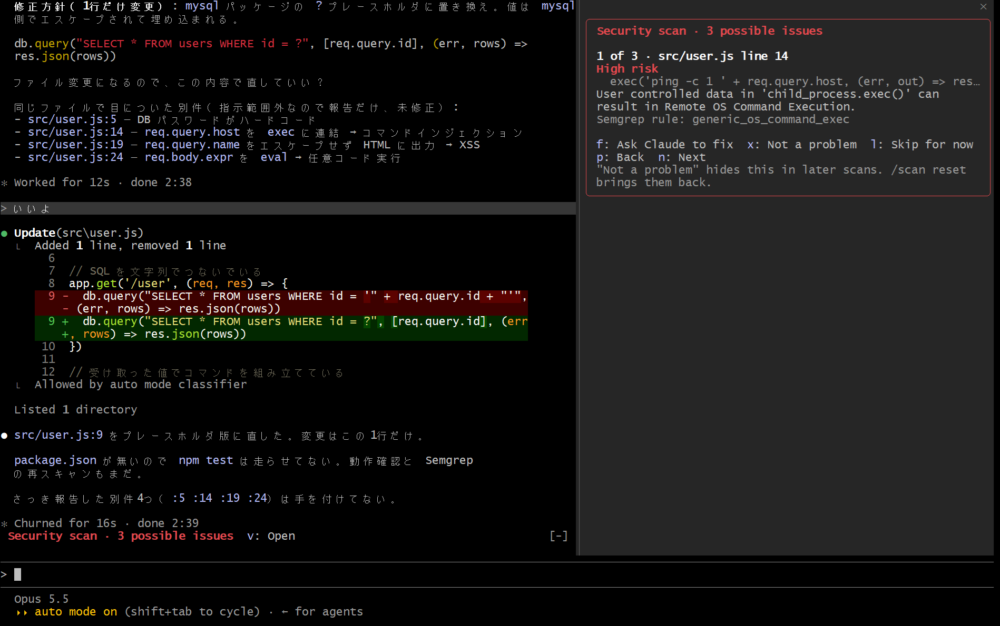

# security-scan

Claude Code の mod（Claude Code の動きや画面を変えられるプラグイン）  
変更中のファイルを [Semgrep](https://semgrep.dev/) で調べ、見つかった脆弱性を画面の右で1件ずつふるい分けて、本物だけ Claude に直させる

## 課題

脆弱性のスキャナは、本物と一緒に誤検知も大量に出す  
作者の個人リポジトリ32個に Semgrep をかけると合計253件出て、14件を読んで確かめたら本物らしいのは3件、誤検知が9件だった（2026-10-09、1回）  
結果を全部 Claude に渡すと、誤検知まで直そうとして要らない書き換えが増える  
かといって自分で一覧を読んで選ぶのは手間がかかり、結局見なくなる

## 導入

Claude Code 2.1.287 以降が必要（`claude --version` で確認）  
早期公開のときに `CLAUDE_CODE_ENABLE_FUNCTION_HOOKS` を設定していたら削除（2.1.287 以降は無視される、[公式の mods の概要のページ](https://code.claude.com/docs/en/plugins/mods/overview)）  
Semgrep が必要 ── [uv](https://docs.astral.sh/uv/) か [pipx](https://pipx.pypa.io/) で、ほかの Python のパッケージと分けて入れる（`uv tool install semgrep`）

1. このリポジトリを marketplace（プラグインの配布元）として登録

   ```
   /plugin marketplace add shumatsumonobu/claude-mods-bench
   ```

2. security-scan を入れる

   ```
   /plugin install security-scan@claude-mods-bench
   ```

3. Claude Code を起動し直す ── 次の起動から有効、初回に作業フォルダの信頼を求められたら承認  
   開いたままのセッションなら、`/reload-plugins` でも読み込める（[公式の mods の概要のページ](https://code.claude.com/docs/en/plugins/mods/overview)）

Semgrep を PATH の通らない場所に入れた場合は、`/config` で場所を入れる（下の設定の節）

## 動作

起動すると画面の右が開き、変更中のファイル（`git status` に出るもの）を Semgrep で調べる  
見つかったものを、深刻な順に1件ずつカードで表示  
同じ行に当たったルールは、1枚のカードにまとめる


カードのキー

| キー | ボタン | 動き |
|---|---|---|
| `f` | `Ask Claude to fix` | Claude に「本物か確かめて、本物なら最小の変更で直して」と送り、一覧から外す |
| `x` | `Not a problem` | 誤検知として覚え、次に調べたときも出さない |
| `l` | `Skip for now` | 一覧の最後に回す |
| `p` / `n` | `Back` / `Next` | 前と次のカードへ |
| `u` | `Undo` | 直前の `Not a problem` を取り消す（押した直後だけ出る） |

下は、SQL の文字列連結のカードで `f` を押したあと  
Claude は指摘を本物と判断し、9行目を `?` のプレースホルダに直した  
同じ返事の中で、Semgrep が拾わなかった5行目のパスワードの直書きにも触れていた（1回）



`/scan` で、いつでも調べ直せる  
`/scan reset` で、`Not a problem` で覚えたものを全部忘れて調べ直す  
プロンプトの上の1行には、残っている件数を表示（`v` で画面の右を開く）

## 設定

`/config` の次の行から変更

| 行 | 既定 | 中身 |
|---|---|---|
| `Semgrep command · security-scan` | `semgrep` | Semgrep の実行ファイル、PATH に無ければフルパス |
| `Rule sets · security-scan` | `p/nodejsscan,p/owasp-top-ten` | Semgrep のルールの組、カンマ区切り |

ユーザーの `~/.claude/settings.json` に直接書く場合（`/config` もここに保存する、2.1.295 で1回確認）  
プロジェクトの `.claude/settings.json` に書いても読まれない（[公式の settings のページ](https://code.claude.com/docs/en/settings-reference#pluginconfigs)）

```json
{
  "pluginConfigs": {
    "security-scan@claude-mods-bench": {
      "options": {
        "semgrep": "C:/tools/semgrep/Scripts/semgrep.exe",
        "rules": "p/nodejsscan,p/owasp-top-ten"
      }
    }
  }
}
```

ルールの組で、拾えるものが変わる  
脆弱性を4つ仕込んだ JavaScript のファイルで試した結果（各1回）

| ルールの組 | 拾えたもの |
|---|---|
| `p/nodejsscan` | SQL の文字列連結、コマンドの組み立て、XSS、eval |
| `p/expressjs` | SQL の文字列連結、XSS、eval |
| `p/owasp-top-ten` | XSS、eval |
| `p/security-audit` | コマンドの組み立て |

パスワードの直書きは、どの組でも拾えなかった

## 設計上の理由

mod は Claude Code の中で動くため、shell hook（`settings.json` に定義する従来のフック）では書けない次のことができる

- **人がふるい分けてから Claude に渡せる** ── shell hook でもスキャナを回して結果を Claude に返せるが、誤検知も含めて全部渡すことになる  
  mod なら、画面の右にカードを出し、人が選んだものだけを `$.prompt.submit` で Claude に送れる
- **一覧を見える所に置いておける** ── shell hook は画面に描けない（[公式の mods の概要のページ](https://code.claude.com/docs/en/plugins/mods/overview)）  
  カードは会話と別の場所に残り、会話が流れても消えない
- **誤検知を覚えておける** ── `Not a problem` にしたものは `$.store`（mod 専用の保存領域）に覚え、次のセッションでも出さない
- **Claude に頼まずに調べられる** ── 起動時と `/scan` で mod が自分で Semgrep を動かすので、Claude のトークンを使わない  
  `/scan` は Claude の作業中でも打てる作り（[公式の Use the mods API のページ](https://code.claude.com/docs/en/plugins/mods/api)、未実測）

## 仕様上の注意

実測（Claude Code 2.1.295、Windows）と、公式ドキュメントを読んだ範囲

- **調べるのは変更中のファイルだけ** ── `git status` に出るコードのファイルを渡す  
  git の管理下でないフォルダでは、調べるファイルが無い扱いになる（コードの作り、未実測）
- **変更中のファイルが数百あると、Semgrep が起動できないことがある** ── ファイルの名前を並べて渡すため、Windows のコマンドの長さの上限（約3万2千文字）を超えうる（未実測）
- **調べるのに数秒かかる** ── 小さなファイル2つで6〜10秒（ルールの組ごとに各1回）、その間は画面の右に `scanning` と出る
- **会社の PC では、Semgrep が止められることがある** ── 作者の PC では、`uv tool install` で入れた Semgrep が「アプリケーション制御ポリシー」で起動できなかった（1回）  
  そのときは、止められない場所に入れて、`/config` で場所を入れる
- **Claude が直す前に確認を求めることがある** ── `CLAUDE.md` にファイルを変える前の確認を書いていると、Claude は直し方を示して確認を待つ（作者の環境で1回）
- **画面の右が自動で開くのは、端末の横幅が144文字以上のとき** ── mod が自分で開く表示の制限（[公式のリファレンス](https://code.claude.com/docs/en/plugins/mods/reference)）  
  `/scan` で開けば、どの幅でも表示
